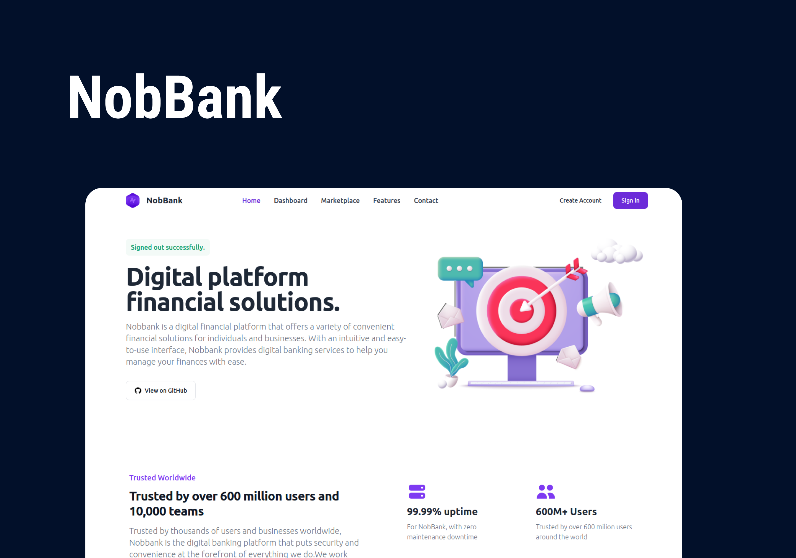

# TESTE TÉCNICO - Nobe Sistemas
<br>
<div align="center">
    
</div>
<br>

## 💻 Projeto

 **NobBank**
 - [Deploy - Acesse o projeto](https://nobbank.fly.dev/)

## 🚀 Tecnologias

- Ruby 3.2.2
- Rails 7.0.4
- PostgreSQL
- Hotwire - (Turbo e Stimulus)
- Tailwind CSS
- Esbuild
- Gem: Devise
- Gem: Rspec
- Deploy ~> Fly.io

## 💥 Funcionalidades

**WEB**
- [x] Login - User
- [x] Realizar Saques ou Depósitos na conta do usuário
- [x] Realizar Transferências entre Contas
- [x] Histórico de transações realizadas ordenadas por data e hora


## ⚡ Instalando o Projeto

```bash
# clonar o projeto
git clone git@github.com:GeorgePires/NobBank.git

# entre no diretório clonado
cd NobBank

# instalar dependências do Ruby on Rails
bundle install

# instalar dependências do Node e esbuild
npm install

# criar os bancos de dados e adicionar usuários
rails dev:setup

```
```bash
# Usuários
    # Realizar Saque, Depósito e Transferências da conta do George para a conta Wes 
    - George: george@gmail.com | senha: 123246
    - Wes: wes@gmail.com | senha: 123246
```
```bash
# executar o projeto
./bin/dev 

Entre no endereço: http://localhost:3000
```
